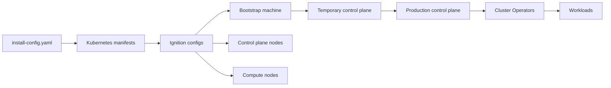

# Stage 03: Architecture Map

This stage builds a concrete, component-level map of how OpenShift 4.18 comes to life on bare metal. If you are new to Kubernetes or OpenShift, read `stages/02-foundations/README.md` first.

**Sources used in this stage**
- `../pdfs/openshift/Installation_overview.pdf`
- `../pdfs/openshift/Installing_on_bare_metal.pdf`
- `../pdfs/openshift/Architecture.pdf`
- `../pdfs/openshift/Installing_on-premise_with_Assisted_Installer.pdf`
- `../pdfs/openshift/Installing_an_on-premise_cluster_with_the_Agent-based_Installer.pdf`

**Scope**
- HA is the primary flow.
- SNO differences are described when they change the mechanics.
- Focus is on how the system works under the hood, not on a single installer path.

## System map at a glance

OpenShift installation is a pipeline of artifacts that become running components.

## Component responsibilities (what each part actually does)

| Component | What it does | Why it matters during install |
| --- | --- | --- |
| Bootstrap machine | Runs a temporary control plane | Seeds the production control plane |
| Machine Config Server (MCS) | Serves Ignition to nodes | Control plane nodes fetch Ignition from here |
| etcd | Stores cluster state | Must reach quorum for control plane to stabilize |
| kube-apiserver | Serves API | All nodes and operators depend on it |
| kube-controller-manager | Reconciles resources | Drives desired state convergence |
| kube-scheduler | Places pods | Operators rely on scheduling |
| Cluster Version Operator (CVO) | Applies release payload | Owns platform version and updates |
| Machine Config Operator (MCO) | Applies node config and OS changes | Enforces node configuration after bootstrap |
| Assisted service | Manages clusters and hosts | Provides Ignition and install orchestration |
| Agent | Reports inventory and executes steps | Enables Assisted and Agent-based flows |
| Installer (assisted-installer) | Writes RHCOS to disk | Performs the actual OS installation |

## Artifact flow (what gets produced and consumed)

| Artifact | Produced by | Consumed by | Why it exists |
| --- | --- | --- | --- |
| `install-config.yaml` | You (or Assisted service UI/API) | Installer, Assisted service | Source of cluster intent |
| Manifests | Installer or service | Bootstrap process | Defines cluster components |
| Ignition configs | Installer or service | Booting nodes | First-boot provisioning for RHCOS |
| Release image | Red Hat registry | CVO | Single versioned source of platform manifests |

## Bootstrap and pivot sequence (HA)

The installation overview defines these phases. The list below adds the practical cause-and-effect.

1. Bootstrap machine starts and hosts remote resources required for control plane nodes to boot.
2. Bootstrap machine starts a single-node etcd and a temporary API server.
3. Control plane nodes fetch Ignition from the Machine Config Server on the bootstrap node.
4. Control plane nodes start their own static pods for the control plane.
5. The temporary control plane schedules the production control plane.
6. CVO starts and installs the etcd Operator.
7. etcd scales out to all control plane nodes and reaches quorum.
8. The temporary control plane shuts down and hands off to the production control plane.
9. The bootstrap machine is removed from the API and MCS load balancer pools.
10. The control plane configures compute nodes and installs additional Operators.

## What changes in SNO

Single Node OpenShift collapses bootstrap and control plane into the same node. The sequence above still occurs, but bootstrap and pivot are local operations on a single machine, not a handoff between machines.

## Installer variants, same mechanics

Every installer method produces the same three assets and runs the same bootstrap phases. What changes is who generates the assets and how nodes receive Ignition.

| Method | Who generates assets | How nodes receive Ignition | Discovery agent |
| --- | --- | --- | --- |
| UPI | You run `openshift-install` | You host or inject Ignition | No |
| Assisted Installer | Assisted service | Service delivers Ignition | Yes |
| Agent-based Installer | Local embedded service | Embedded in discovery image | Yes |

## Observability hooks (when you have a cluster)

These are not required now, but they anchor the architecture to real signals once you start testing.

- `oc get clusterversion`
- `oc get clusteroperators`
- `oc get nodes -o wide`
- `oc -n openshift-etcd get pods`
- `oc -n openshift-machine-config-operator get pods`
- `oc -n openshift-kube-apiserver get pods`

**Deliverables for this stage**
- A component-level map of how the cluster is assembled.
- A clear bootstrap and pivot timeline tied to actual components.
