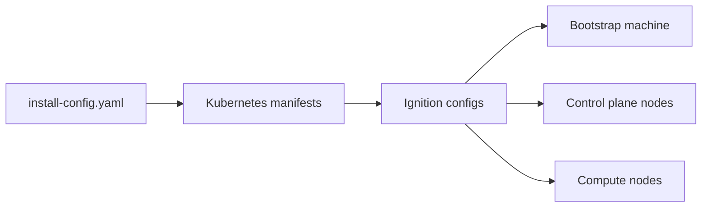
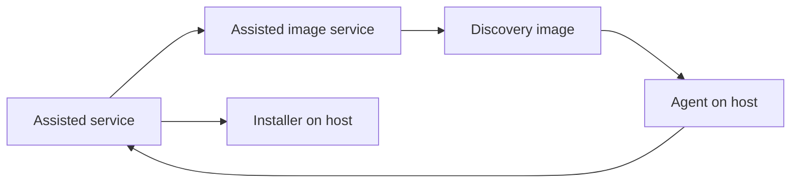

# Stage 02: Architecture Map

This stage produces a shared mental model of how OpenShift 4.18 is assembled on bare metal, with emphasis on the bootstrap and pivot process and the artifacts that drive it.

**Sources used in this stage**
- `../pdfs/openshift/Installation_overview.pdf`
- `../pdfs/openshift/Installing_on_bare_metal.pdf`
- `../pdfs/openshift/Architecture.pdf`
- `../pdfs/openshift/Installing_on-premise_with_Assisted_Installer.pdf`
- `../pdfs/openshift/Installing_an_on-premise_cluster_with_the_Agent-based_Installer.pdf`

**Scope**
- HA is the primary flow.
- SNO differences are described as notes when they change the mechanics.
- Focus is on how the system works under the hood, not on a single installer path.

**Core building blocks**
- Control plane: etcd, kube-apiserver, kube-controller-manager, kube-scheduler.
- Compute nodes: run user workloads.
- RHCOS: immutable OS image used by all nodes.
- Ignition: first-boot provisioning that partitions disks, writes files, and configures users.
- Operators: controllers that reconcile desired state. Critical early operators include CVO and MCO.
- Bootstrap machine: temporary control plane that seeds the production control plane.

**Artifact and configuration flow**
OpenShift installation uses three asset types: `install-config.yaml`, Kubernetes manifests, and Ignition configs. The install-config is transformed into manifests, and manifests are wrapped into Ignition configs for each machine type. These Ignition configs are what the nodes actually consume to build the cluster.

**Bootstrap and pivot sequence (HA)**
The official installation overview describes the bootstrap process as a sequence where a temporary bootstrap machine stands up the initial control plane, which then pivots to the production control plane.

1. Bootstrap machine starts and hosts the remote resources required for control plane nodes to boot.
2. Bootstrap machine starts a single-node etcd and a temporary Kubernetes control plane.
3. Control plane nodes fetch resources from the bootstrap machine and finish booting.
4. Temporary control plane schedules the production control plane on the control plane nodes.
5. CVO comes online and installs the etcd Operator.
6. Etcd Operator scales etcd to all control plane nodes.
7. Temporary control plane shuts down and hands off to the production control plane.
8. Bootstrap machine injects OpenShift components into the production control plane.
9. Installation program shuts down the bootstrap machine.
10. Control plane sets up compute nodes and additional Operators.

**SNO note**
Single Node OpenShift collapses bootstrap and control plane into a single node. The same logical phases occur, but the bootstrap and pivot steps run on the same machine.

**Network and DNS baseline (UPI and bare metal)**
The bare metal installation docs list required DNS records and load balancers. These are the core records for HA:
- `api.<cluster>.<base_domain>` points to the API load balancer and must resolve both inside and outside the cluster.
- `api-int.<cluster>.<base_domain>` points to the internal API load balancer and must resolve inside the cluster.
- `*.apps.<cluster>.<base_domain>` points to the application ingress load balancer.
- `bootstrap.<cluster>.<base_domain>` points to the bootstrap machine during install.
- `<control-plane><n>.<cluster>.<base_domain>` records for each control plane node.
- `<compute><n>.<cluster>.<base_domain>` records for each compute node.

**Installer variants (mechanics view)**
This project avoids hard-coding a single installer path. Instead, we map how each approach supplies the same artifacts and flows.

| Method | Who provisions infra | How nodes get Ignition | Discovery agent | Best fit |
| --- | --- | --- | --- | --- |
| IPI (not bare metal) | Installer | Installer-managed | No | Cloud platforms with API integration |
| UPI | User | User serves or injects Ignition | No | Full control, maximum manual steps |
| Assisted Installer | Assisted service + agent | Generated and delivered by service | Yes | Interactive install with validations |
| Agent-based Installer | Local embedded service + agent | Generated locally and embedded in image | Yes | Disconnected environments |

**Assisted and Agent-based architecture (high-level)**
- Assisted service: API and state machine for clusters and hosts.
- Assisted image service: creates discovery images with embedded identity and service endpoints.
- Agent: runs on the discovery image, reports inventory, executes steps.
- Installer: runs as a privileged container to install RHCOS to disk.

**Key takeaways**
- The cluster is built from Ignition configs derived from a single install-config input.
- Bootstrap is a temporary control plane; production control plane assumes control after pivot.
- In HA, etcd scales from bootstrap to a multi-node cluster under operator control.
- Assisted and Agent-based installers wrap the same underlying mechanics with agent-driven discovery and provisioning.

**Deliverables for this stage**
- Architecture map and flow diagrams for HA installation and bootstrap pivot.
