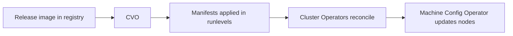

# Stage 04: Release Payload and Tools (Connected)

This stage explains what the OpenShift release payload is, how it drives cluster state, and which tools you need in a connected environment to inspect or use it. We stay focused on mechanics, not a specific installer path.

**Sources used in this stage**
- `../pdfs/openshift/Installation_overview.pdf`
- `../pdfs/openshift/Updating_clusters.pdf`
- `../pdfs/openshift/CLI_tools.pdf`

**Scope**
- Connected registry access (official public registries).
- How the release image is consumed by the Cluster Version Operator (CVO).
- Tooling required to work with payloads and to generate core installation assets.

**Why the release payload matters**
OpenShift is delivered as a release image. The Cluster Version Operator (CVO) pulls a target release image from a registry and applies the manifests it contains in ordered runlevels. As each runlevel is applied, the CVO waits for cluster Operators to report stable conditions before proceeding. After the control plane updates, the Machine Config Operator (MCO) updates the operating system and configuration of cluster nodes.

Mechanics view:
- The release image is a container image that includes manifests for the full OpenShift version.
- The CVO retrieves the image from a registry and applies manifests in stages.
- Operators reconcile their components based on those manifests.
- The MCO then updates node OS and configuration.



**How this ties back to installation**
The installation program produces three asset types: `install-config.yaml`, Kubernetes manifests, and Ignition configs. The bootstrap process uses those Ignition configs to bring the cluster up. Once the control plane is running, the CVO takes over the cluster state by consuming the release image and applying the platform manifests.

**Installer variants and tooling implications**
- Assisted Installer: no install program download. You configure the cluster in the service and boot discovery images.
- Agent-based Installer: you download the installer and generate a discovery image locally.
- UPI or other manual flows: you download the installer to generate assets, then provide infra yourself.

**Tools you need (connected baseline)**
- `openshift-install`: Generates install assets (`install-config.yaml` -> manifests -> Ignition).
- `oc`: Primary CLI for cluster interaction and inspection.
- `podman` or another OCI client: Pull and inspect images when needed.
- `coreos-installer`: Useful for inspecting or embedding Ignition into RHCOS images.

**Pull secret**
Connected installs require a registry pull secret for OpenShift components. This pull secret is used by the installer and later stored in the cluster for image pulls.

**Verification checks**
1. Verify installer and CLI versions (no cluster required):

```bash
openshift-install version
oc version --client
```

2. Once the cluster is up, verify the cluster version and payload:

```bash
oc get clusterversion
oc describe clusterversion version
```

**Deliverables for this stage**
- Release payload mental model and its role in cluster convergence.
- Connected toolchain inventory for later stages.
